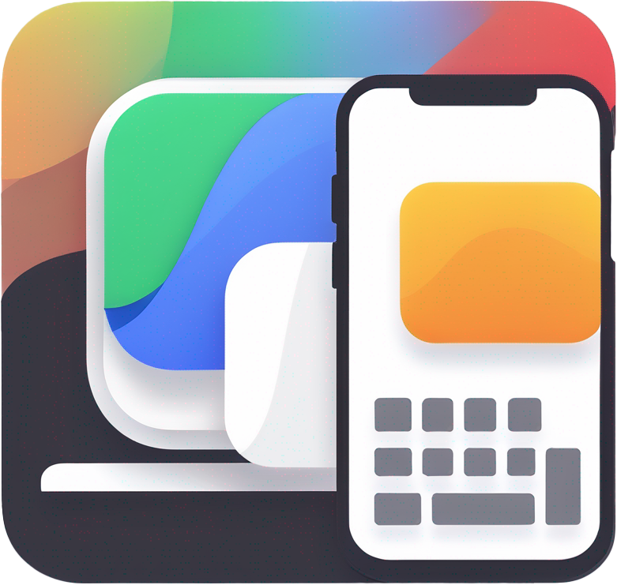
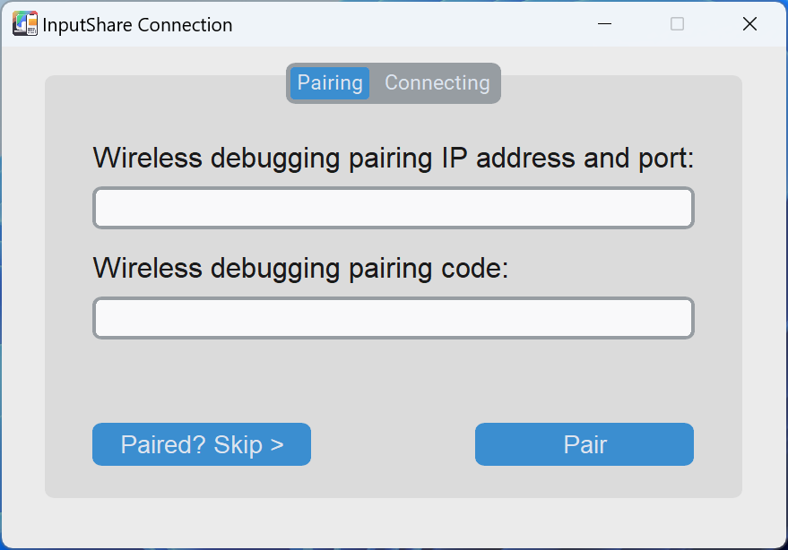
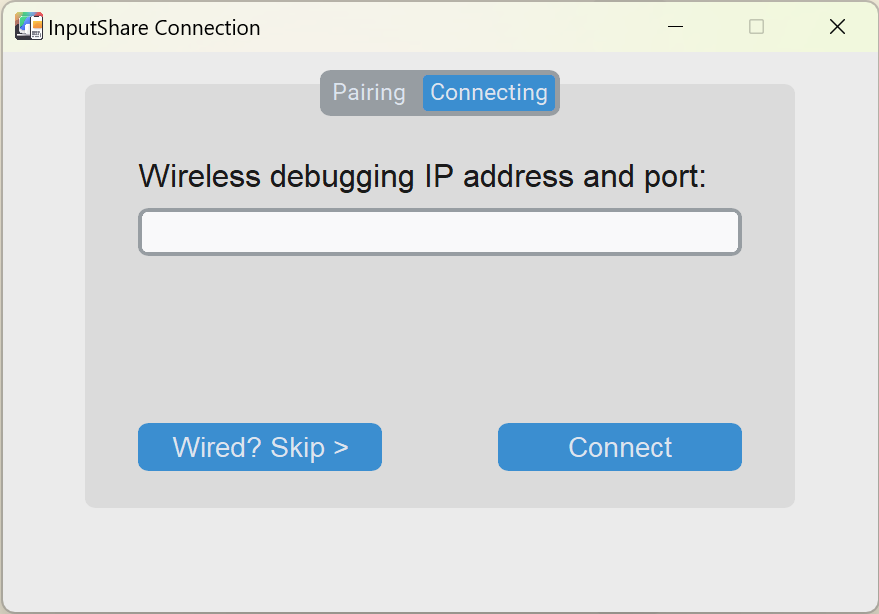
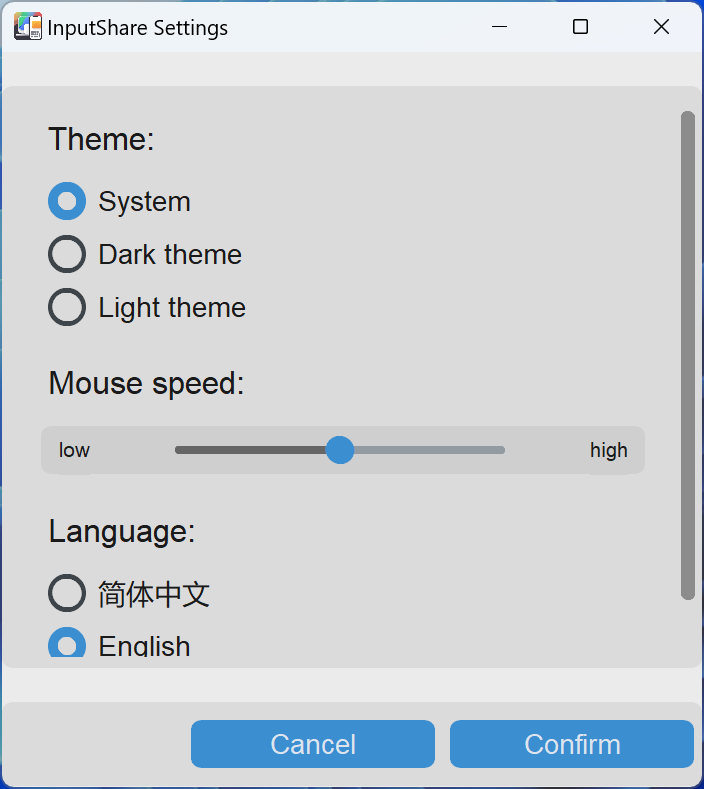
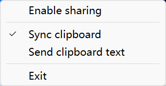

     
    
    <h1>InputShare</h1>
    <a href="README_zh.md">中文介绍</a> | 
    <a href="https://bhznjns.github.io/InputShare/">Homepage</a> | 
    <a href="https://github.com/BHznJNs/InputShare/issues">Feedback</a> |
    <a href="https://discord.gg/GcHPRR4K">Discord</a>
     
     

__InputShare__ enables you to share the keyboard and mouse of your computer with an Android device via ADB in wired / wireless way.

## Features

- __Seamless Switching__: Quickly switch keyboard and mouse input between the PC and Android device via hotkey and edge toggling.
- __Wired / Wireless Connection__: Supports both wired and wireless connections for flexible input sharing.
- __Wide Compatibility__: Compatible with various Android devices, not a specific brand.
- __Clipboard Sync__: Seamlessly sync clipboard content between your computer and Android device.
- __Easy-to-Use GUI__

## Screenshots

| Pairing | Connecting | Settings | System Tray |
| --- | --- | --- | --- |
|  |  |  |  |

## Install

Go to the [release page](https://github.com/BHznJNs/InputShare/releases) and download the latest compressed package, uncompress it and the executable is in it.

## Usage

You firstly need to enable the __Developer Settings__ of your Android device.

For wired connection:

1. Enable the __USB Debugging__ in the __Developer Settings__ page
2. Connect your device with computer via a USB cable
3. Just run the executable and skip the pairing and connecting steps
4. Enjoy your mouse and keyboard on Android device

For wireless connection:

1. Enable the __Wireless Debugging__ in the Developer Settings page
2. Run the executable
3. On your Android device: Open __Pair device with pairing code__ option and input the IP address and port and the pairing code into the pairing tab of connecting window (This is the pairing step which is generally needed for the first time use)
4. Input the IP address and port in the main __Wireless Debugging__ into the connecting tab of connection window
5. Enjoy your mouse and keyboard on Android device

## User documentation

- [Shortcuts](./docs/shortcuts_en.md)
- [FAQs](./docs/faqs_en.md)
- [Development](./docs/development_en.md)
