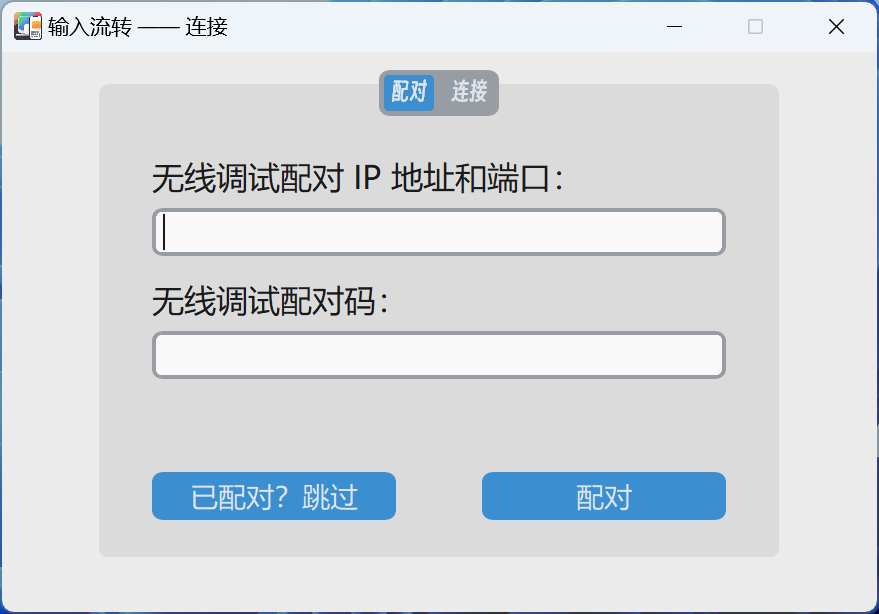
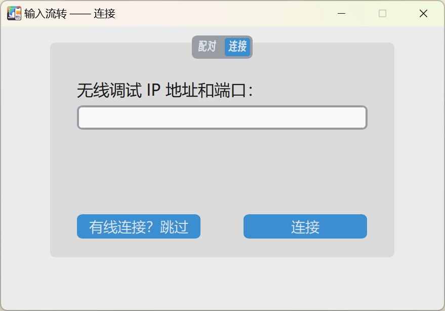
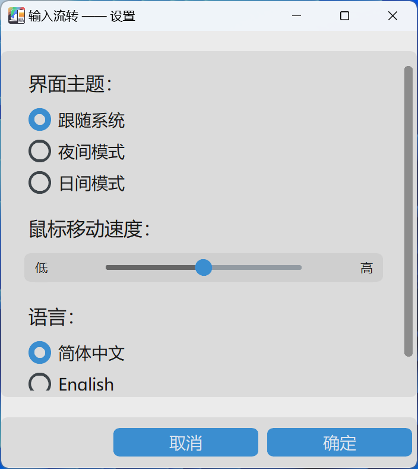

     
    
    <h1>输入流转</h1>
    <a href="README_zh.md">中文介绍</a> | 
    <a href="https://bhznjns.github.io/InputShare/">项目主页</a> | 
    <a href="https://github.com/BHznJNs/InputShare/issues">问题反馈</a>
     
     

__输入流转__ 能够让你的安卓设备通过有线/无线的方式和电脑**共享键鼠**。

## 特点

- __无感切换__：通过键盘热键或贴边切换快捷地在电脑和安卓设备间切换
- __有线/无线连接__：支持 USB 有线和局域网无线两种方式连接你的设备
- __强兼容性__：适用于多种安卓设备，不局限于特定品牌的电脑和安卓设备
- __剪贴板同步__：让电脑与手机的剪贴板内容无缝同步
- __简单易用的图像界面__

## 屏幕截图

| 配对界面 | 连接界面 | 软件设置 | 系统托盘 |
| --- | --- | --- | --- |
|  |  |  |  |

## 安装

请前往[发布界面](https://github.com/BHznJNs/InputShare/releases)下载最新版本的压缩包，解压，运行其中的 `.exe` 可执行文件。

## 使用方法

你首先需要启用你的安卓设备上的 __开发者选项__。

__对于有线连接：__

1. 在 __开发者选项__ 界面下启用 __USB 调试__
2. 使用 USB 数据线连接你的电脑和安卓设备
3. 运行可执行文件，跳过配对和连接步骤
4. 你可以开始正常使用了

__对于无线连接：__

1. 在 开发者选项 页面中开启 无线调试
2. 运行可执行文件
3. 在安卓设备上：打开“使用配对码配对设备”选项，并在电脑端连接窗口的配对标签页中输入 IP 地址、端口及配对码，点击“配对”按钮（此为配对步骤，通常只在第一次使用软件时需要）
4. 将安卓设备上“无线调试”界面下的 IP 地址和端口输入到连接窗口的连接标签页中，点击“连接”按钮
5. 你可以开始正常使用了

## 用户文档

- [快捷键](./docs/shortcuts_zh.md)
- [常见问题](./docs/faqs_zh.md)
- [开发](./docs/development_zh.md)
